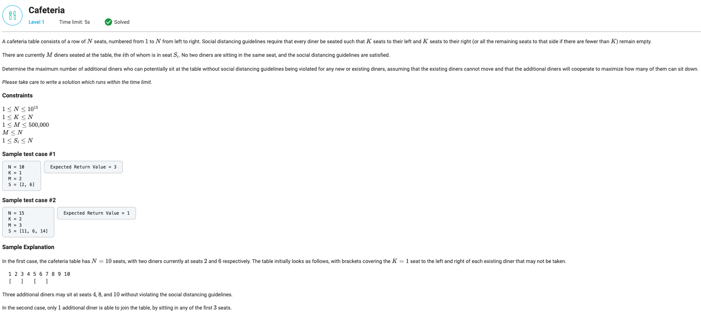

## Cafeteria



```python
import math
from typing import List


def getMaxAdditionalDinersCount(N: int, K: int, M: int, S: List[int]) -> int:
    S.sort()
    S.append(N + K + 1)

    start = 1
    result = 0
    for seat in S:
        delta = seat - K - start
        if delta > 0:
            result += math.ceil(delta / (K + 1))
        start = seat + K + 1
    return result
```
