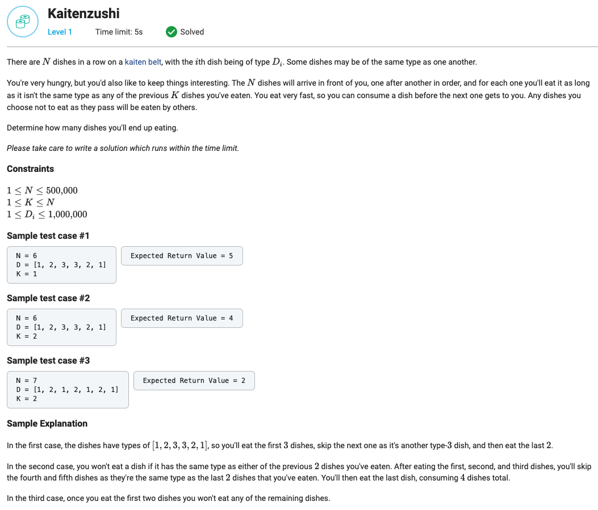

## Kaitenzushi



```python
from collections import deque, Counter
from typing import List


def getMaximumEatenDishCount(N: int, D: List[int], K: int) -> int:
    queue = deque()
    dish_counter = Counter()
    result = 0

    for dish in D:
        if len(queue) > K:
            dish_removed = queue.popleft()
            dish_counter[dish_removed] -= 1
        if dish_counter[dish] == 0:
            result += 1
            queue.append(dish)
            dish_counter[dish] += 1

    return result
```
