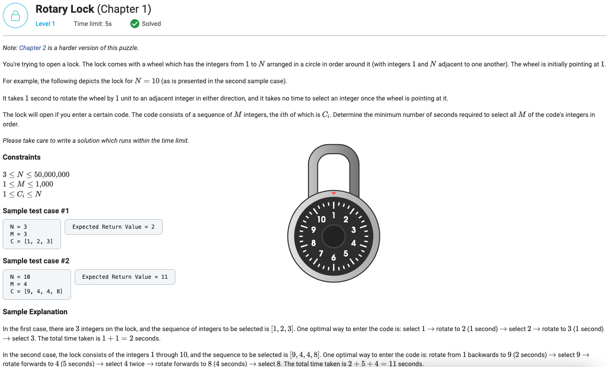

## Rotary Lock (Chapter 1)



```python
from typing import List


def getMinimalPathLength(N, start, end):
    direct_path_length = abs(end - start)
    return min(direct_path_length, N - direct_path_length)


def getMinCodeEntryTime(N: int, M: int, C: List[int]) -> int:
    C = [1] + C
    return sum(getMinimalPathLength(N, C[index], C[index + 1]) for index in range(M))

```
