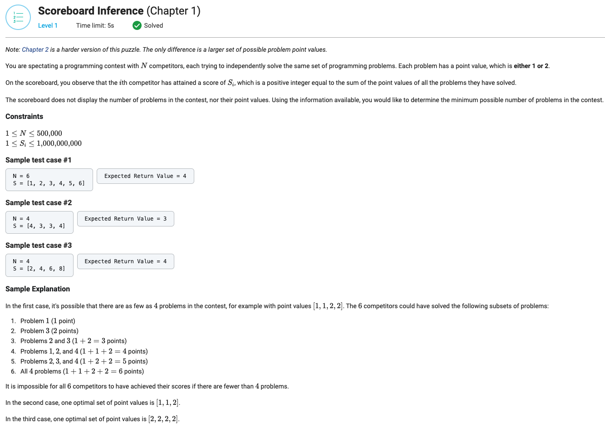

## Scoreboard Inference (Chapter 1)



```python
from typing import List


def getMinProblemCount(N: int, S: List[int]) -> int:
    point_values = {'1': 0, '2': 0}

    for score in S:
        divider = score // 2
        if point_values['2'] < divider:
            point_values['2'] = divider
        if score % 2 == 1:
            point_values['1'] = 1

    return sum(point_values.values())
```
