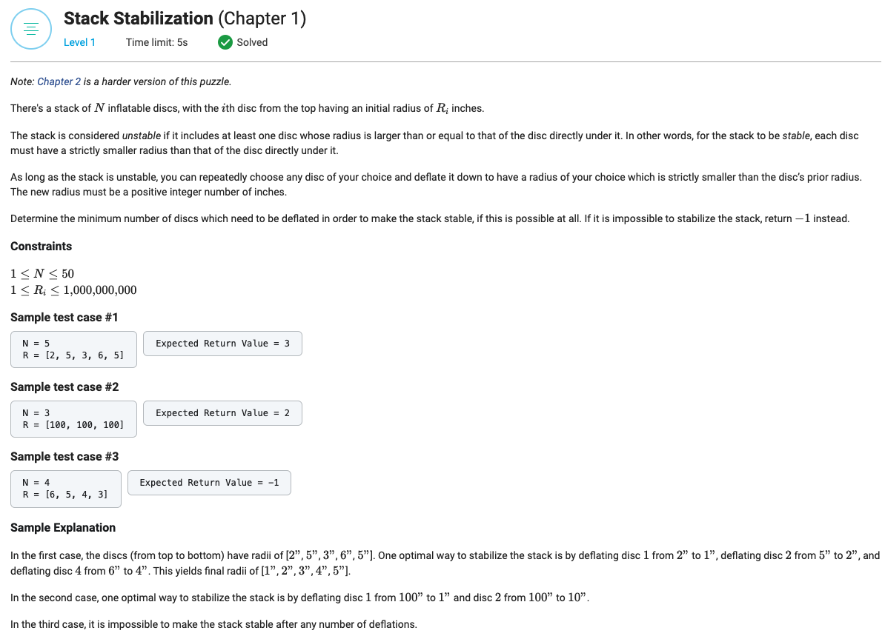

## Stack Stabilization (Chapter 1)




```python
from typing import List


def getMinimumDeflatedDiscCount(N: int, R: List[int]) -> int:
    result = 0

    R = list(reversed(R))

    for disc_index, radius in enumerate(R):
        if radius < N - disc_index:
            result = -1
            break
        if disc_index < N - 1:
            bottom_radius = R[disc_index + 1]
            if bottom_radius >= radius:
                R[disc_index + 1] = radius - 1
                result += 1

    return result
```
