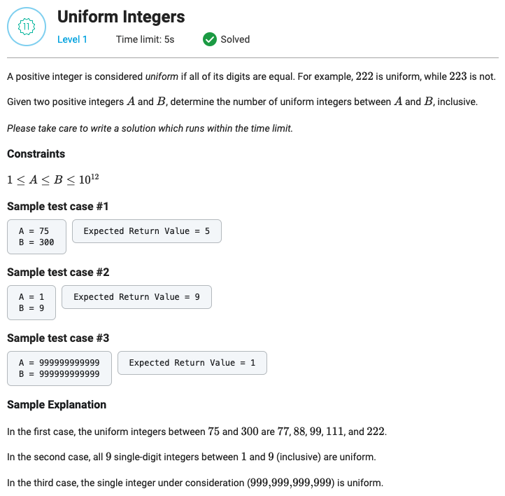

## Uniform Integers



```python
def getDigits(x: int):
    return len(str(x))


def uniformIntegersFactory(digits: int):
    divider = int('1' * digits)
    return [i for i in range(divider, divider * 9 + 1, divider)]


def getUniformIntegerCountInInterval(A: int, B: int) -> int:
    result = 0

    for digit in range(getDigits(A), getDigits(B) + 1):
        for uniform_integer in uniformIntegersFactory(digit):
            if A <= uniform_integer <= B:
                result += 1
    return result
```
