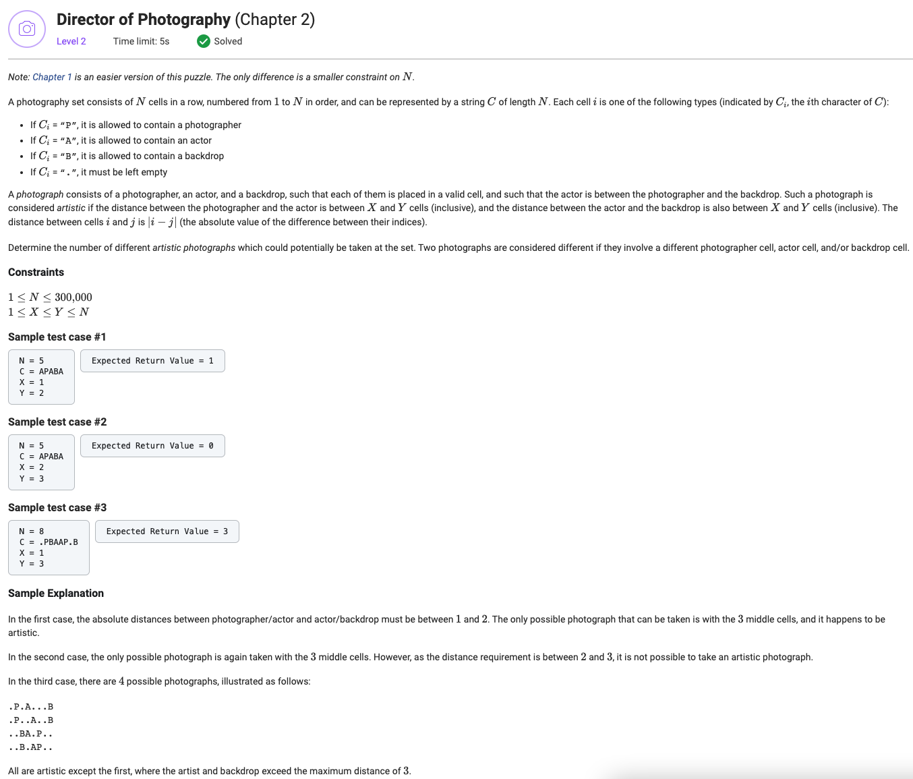

## Director of Photography (Chapter 2)



```python
import numpy


def bounded(i, N):
    return max(0, min(i, N))


def getArtisticPhotographCount(N: int, C: str, X: int, Y: int) -> int:
    P_cumulative_sum = [0] + list(numpy.cumsum([1 if cell == 'P' else 0 for cell in C]))
    B_cumulative_sum = [0] + list(numpy.cumsum([1 if cell == 'B' else 0 for cell in C]))

    result = 0

    for index, cell in enumerate(C):
        if cell != 'A':
            continue

        left_window = (bounded(index - Y, N), bounded(index - X + 1, N))
        right_window = (bounded(index + X, N), bounded(index + Y + 1, N))

        P_left_count = P_cumulative_sum[left_window[1]] - P_cumulative_sum[left_window[0]]
        B_right_count = B_cumulative_sum[right_window[1]] - B_cumulative_sum[right_window[0]]

        P_right_count = P_cumulative_sum[right_window[1]] - P_cumulative_sum[right_window[0]]
        B_left_count = B_cumulative_sum[left_window[1]] - B_cumulative_sum[left_window[0]]

        result += P_left_count * B_right_count + B_left_count * P_right_count

    return result
```
