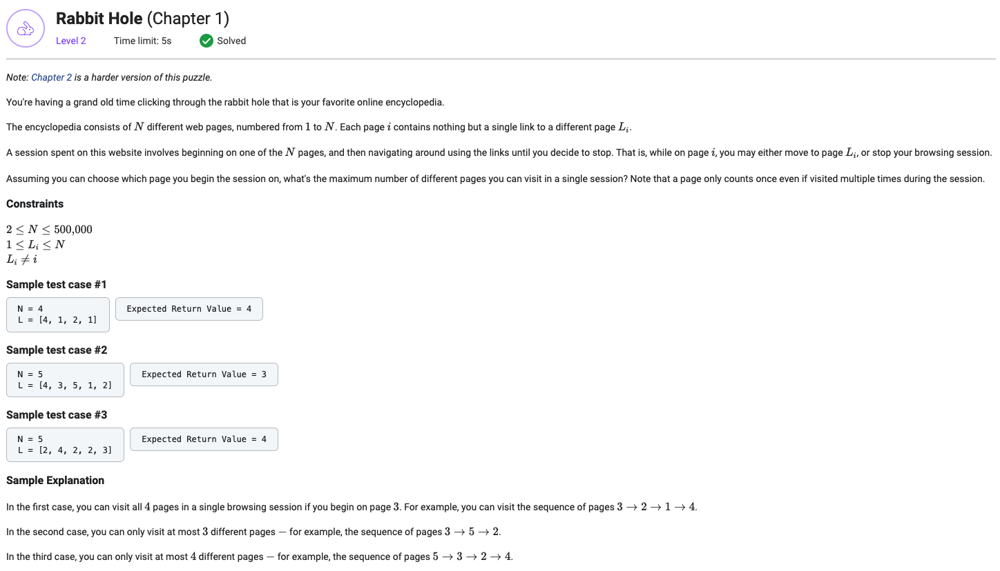

## Rabbit Hole (Chapter 1)



```python
from typing import List


def getMaxVisitableWebpages(N: int, L: List[int]) -> int:
    L = [page - 1 for page in L]

    visited = [-1] * N
    path_lengths = [0] * N
    stack = []
    in_stack = [False] * N

    def DFS(page):
        time = 0

        while not path_lengths[page] and not in_stack[page]:
            stack.append(page)
            in_stack[page] = True
            visited[page] = time
            time += 1
            page = L[page]

        if not path_lengths[page]:
            previous_page = page
            path_lengths[previous_page] = time - visited[previous_page]
            while in_stack[previous_page]:
                path_lengths[page] = path_lengths[previous_page]
                page = stack.pop()
                in_stack[page] = False

        while stack:
            previous_page = stack.pop()
            path_lengths[previous_page] = path_lengths[page] + 1
            page = previous_page

    for page in range(N):
        DFS(page)

    return max(path_lengths)
```
