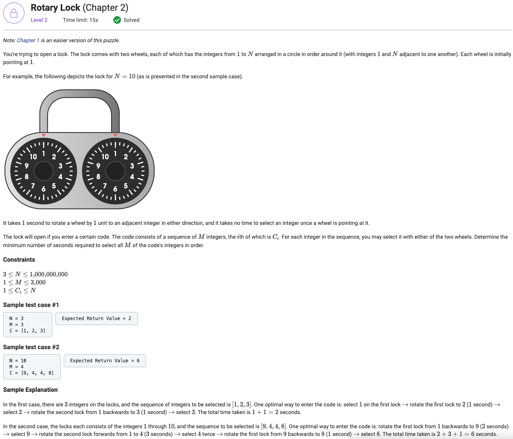

## Rotary Lock (Chapter 2)



```python
from typing import List


def getMinimalPathLength(N, start, end):
    direct_path_length = abs(end - start)
    return min(direct_path_length, N - direct_path_length)


def getMinCodeEntryTime(N: int, M: int, C: List[int]) -> int:
    tree = {
        (C[0], 1): getMinimalPathLength(N, C[0], 1)
    }

    for digit in C[1:]:

        next_tree = {}

        for state in tree.keys():
            left_state = (digit, state[1])
            left_movement = getMinimalPathLength(N, digit, state[0])
            if left_state in next_tree:
                next_tree[left_state] = min(tree[state] + left_movement, next_tree[left_state])
            else:
                next_tree[left_state] = left_movement + tree[state]

            right_state = (state[0], digit)
            right_movement = getMinimalPathLength(N, digit, state[1])
            if right_state in next_tree:
                next_tree[right_state] = min(tree[state] + right_movement, next_tree[right_state])
            else:
                next_tree[right_state] = right_movement + tree[state]

        tree = next_tree

    return min(tree.values())
```
